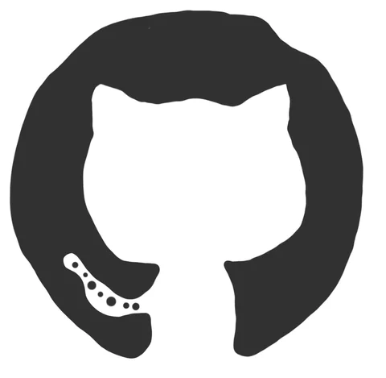

![image-cover]

# ![image-wave] Hello Fellow &lt;Developers/&gt;

![Last update][last-update-shield]
![Visitor Count][visitors]

Hi! My name is SilentWolf6662. Thank You for taking the time to view my GitHub Profile

## **About Me** ![image-escr]

    

        ℹ Who am I?
    

> I’m SilentWolf, a game programmer under programming education in Denmark.

    

        Aliases?
    

> My other aliases is the following:
>
> - SilentWolf
> - Wolf
> - Wolfie
> - Silent
> - SW
> - Ninja

 

    

        🔭 What am I currently working on?
    

> I’m currently working on:
>
> - Unity Projects
> - Minecraft Projects
> - FiveM Projects
> - Other Stuffs

 

    

        🌱 What am I currently learning?
    

> I’m currently learning:
>
> - C#
> - Unity
> - LUA
> - Java

 

    

        👯 What am I looking to collaborate on?
    

> I’m currently not looking to collaborate on
>
> anything at the moment.

 

    

        💬 What can you talk with me about?
    

> You can talk with me about
>
> - Any of the languages and tools I’m using.
> - Freelancing Opportunites.
> - Open Source.

 

    

        🤔 What am I looking for help with?
    

> Primary optimizations

 

    

        ⚡ Some facts about me
    

> I love gaming and coding
>
> I like tabletop games but my most favorite tabletop game is 
>
> I play sometimes guitar

---

## **Languages & Tools** ![image-devslash]

[![C#][icon-csharp]][link-csharp]
[![JavaScript][icon-javascript]][link-javascript]
[![TypeScript][icon-typescript]][link-typescript]
[![CSS3][icon-css]][link-css3]
[![HTML5][icon-html]][link-html5]
[![Discord.JS][icon-discordjs]][link-discordjs]
[![MySQL][icon-mysql]][link-mysql]
[![Apache][icon-apache]][link-apache]
[![Node.JS][icon-nodejs]][link-nodejs]
[![LUA][icon-lua]][link-lua]

 

[![Unity][icon-unity]][link-unity]
[![Jetbrain Rider][icon-rider]][link-rider]
[![Jetbrain IntelliJ][icon-intellij]][link-intellij]
[![Jetbrain Resharper][icon-resharper]][link-resharper]
[![Visual Studio Code Insider][icon-vscinsider]][link-vscinsider]
[![Git][icon-git]][link-git]
[![Github Desktop][icon-github-desktop]][link-github-desktop]

---

## **Connect with me** ![image-handshake]

### [![Github Profile][icon-github]][link-github-profile]

### ![Discord][icon-discord] 
SilentWolf_666#0471

---

## **My Stats** 

[![SilentWolf6662"s GitHub stats][github-stats]][github-link]

[![Top Languages][github-most-languages]][github-link]

[![SilentWolf6662's Wakatime Stats][wakatime-stats]][link-wakatime-profile]

---

## **Some Programming Humor for you** ![image-winky]

![Jokes Card][joke-card]

---

    Made with ❤️ by SilentWolf6662

[top]: #top
[visitors]: https://profile-counter.glitch.me/SilentWolf6662/count.svg
[last-update-shield]: https://img.shields.io/github/last-commit/SilentWolf6662/SilentWolf6662?color=743E8A&label=Last%20update&style=flat-square
[follower-shield]: exampleLink.com
[joke-card]: https://readme-jokes.vercel.app/api?hideBorder&theme=onedark&qColor=%237687db&aColor=%238f45a9
[github-stats]: https://github-readme-stats.vercel.app/api?username=SilentWolf6662&theme=tokyonight&hide=issues&show_icons=true&hide_border=true&border_radius=10&hide_title=true&title_color=7181CE&icon_color=743E8A&text_color=7181CE&bg_color=282C34
[github-link]: https://github.com/SilentWolf6662
[github-most-languages]: https://github-readme-stats.vercel.app/api/top-langs/?username=SilentWolf6662&theme=tokyonight&hide=issues&show_icons=true&hide_border=true&border_radius=10&title_color=7181CE&icon_color=743E8A&text_color=7181CE&bg_color=282C34
[wakatime-stats]: https://github-readme-stats.vercel.app/api/wakatime?username=@SilentWolf6662&compact=true&theme=tokyonight&hide=issues&show_icons=true&hide_border=true&border_radius=10&hide_title=true&title_color=743E8A&icon_color=743E8A&text_color=7181CE&bg_color=282C34
[icon-csharp]: Assets/csharp.svg
[icon-html]: Assets/html.svg
[icon-css]: Assets/css.svg
[icon-apache]: Assets/apache.png
[icon-discord]: Assets/discord.svg
[icon-github]: Assets/github.svg
[icon-javascript]: Assets/javascript.svg
[icon-typescript]: Assets/typescript.svg
[icon-intellij]: Assets/intellij.svg
[icon-mysql]: Assets/mysql.svg
[icon-nodejs]: Assets/nodejs.svg
[icon-resharper]: Assets/resharper.png
[icon-rider]: Assets/rider.svg
[icon-vscinsider]: Assets/vscodeinsider.svg
[icon-unity]: Assets/unity.png
[icon-dnd]: Assets/dnd.svg
[icon-lua]: Assets/lua.svg
[icon-git]: Assets/git.svg
[icon-discordjs]: Assets/discordjs.png
[icon-github-desktop]: Assets/github-desktop.svg
[image-cover]: Assets/nature-bg.jpg
[image-wave]: Assets/wave.gif
[image-devslash]: Assets/devslash32.webp
[image-escr]: Assets/escr40.webp
[image-ineedabr]: Assets/ineedabr50.webp
[image-winky]: Assets/winky.webp
[image-handshake]: Assets/handshake.gif
[link-github-desktop]: https://desktop.github.com
[link-lua]: https://www.lua.org
[link-dnd]: https://dnd.wizards.com
[link-csharp]: https://dotnet.microsoft.com/en-us/languages/csharp
[link-javascript]: https://www.javascript.com
[link-typescript]: https://www.typescriptlang.org
[link-discordjs]: https://discord.js.org/#
[link-mysql]: https://www.mysql.com
[link-unity]: https://unity.com
[link-rider]: https://www.mysql.com
[link-intellij]: https://www.mysql.com
[link-resharper]: https://www.mysql.com
[link-apache]: https://apache.org
[link-nodejs]: https://nodejs.org/en
[link-vscinsider]: https://code.visualstudio.com
[link-github-profile]: https://www.github.com/SilentWolf6662
[link-wakatime-profile]: https://wakatime.com/@SilentWolf6662
[link-java]: https://www.java.com/en/
[link-python]: https://www.python.org/
[link-html5]: https://developer.mozilla.org/en-US/docs/Glossary/HTML5
[link-css3]: https://developer.mozilla.org/en-US/docs/Web/CSS
[link-figma]: https://www.figma.com/
[link-reactjs]: https://reactjs.org/
[link-django]: https://www.djangoproject.com/
[link-mysql]: https://www.mysql.com/
[link-git]: https://git-scm.com/
